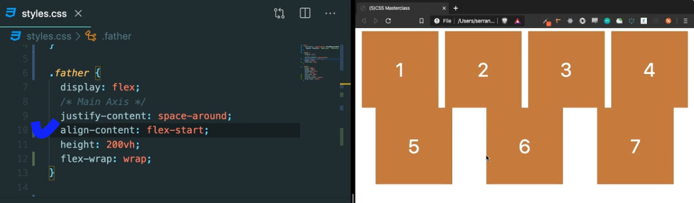

### 1. Flexbox

#### 1.1 first rule of flexbox

- **"father" is the flex container**  
  → write **"display: flex"** to the ~~direct father of the elemets you want to apply positioning~~

#### 1.2 Main Axis, Cross Axis

- Moving elemments on the **main(default : horizontal(수평)) axis**  
  → **justify-content** : modifies the flex chidren ~~on the main axis~~  
  (e.g. justify-content: space-between;)
- Moving elements on the **cross(default : vertical(수직)) axis**
  → **align-items** : modifies the flex chidren ~~on the cross axis~~  
  (e.g. align-items: flex-end;)
- default flex-direction : **row** (main-axis:horizontal / cross-axis: vertical)
- 

#### 1.3 Column and Row

- 만약 flex-direction: row → column : **main axis와 cross axis가 바뀐다**  
  → Moving elemments horizontally : **align-items**  
  → Moving elements vertically : **justify-content**
- flex ー direction에 따라서 **flex container의 width/height를 설정해야 한다.**

#### 1.4 aligh-self and order

- children element의 position에 대해 **children element 안에서 설정하는 단 2가지 경우**
- **align self** : modifies the position of the element on the cross axis  
  → align-items 와 동일, but **자기 자신에 대해서만**  
  → 수정할 element에 align-self: center; 등을 적어준다.)
- **order** : modifies the order of the element **(order=0, by default)**  
  → 같은 father를 가지고 있는 children element 안에서의 순서 지정

#### 1.5 flex-wrap

- flex-box(father) tries to keep children in one line **even it has to change the width** of them
- **flex-wrap : nowrap** (**in one line** > keep the width)
- **flex-wrap : wrap** (**keep the width** > in one line)
- flex-directrion: row-reverse / column-reverse (방향 반대)
- **flex-wrap : wrap-reverse** : keep the width and position bottom to the top  
  (flex-wrap: wrap + flex-drection: row-reverse)
- **align-content** : **main-axis의 line**에 대한 justify-content (줄에 대한 position 설정)  
  (e.g. align-content: flex-start )
  

#### 1.6 flex-grow, flex-shrink (Responsive Web)

- properties that you give to the children to **define how the children will react to the squeezing/ enlarging action**  
  (윈도우를 줄일때, flex-box는 기본 children의 width를 respect안함)
- **flex-shrink** : **윈도우가 줄어 들 때**, 특정 박스가 squeeze되는 정도 설정 (default=1)  
  →2로 셋팅하면 해당child는 다른 children보다 2배 더 shrink
- **flex-grow** : **윈도우가 늘어 날 때**, 특정 박스가 enlarge되는 정도 설정 (default=0)  
  →윈도우가 늘어날 때의 **여분의 공간을 가져간다.**  
  (flex-grow:1, flex-grow:2 -> 여분의 공간을 각각 3분의1, 3분의2 가져감.)

#### 1.7 flex-basis

- properties that is given to the children as **width**
- **flex-basis** : gives **the initial of main-axis size** to the elements (not the fixed size)  
  → **more fluid way of setting the size of elements**
