### 2. Grid

#### 2.1 CSS Grid Basic Concepts

- Grid : flexbox로 Grid(표)를 만들기가 어려워서 Grid전용 컨셉이 등장한 것
-
- **"father" is the grid container**  
  → write **"display: grid"** to the ~~direct father of the elemets you want to apply positioning~~
- **grid-template-columns** : 원하는 column수, 너비를 설정  
  (e.g. grid-template-columns: 250px 250px 200px;)
- **grid-template-rows** : 원하는 row수, 높이를 설정  
  (e.g. grid-template-rows: 100px 50px 30px;)
- **column-gap, row-gap**: column/row간의 공백을 설정  
  (e.g. column-gap: 10px; / row-gap: 10px)  
  → gap 만으로 설정시 row/column간의 공백을 동일하게 설정 가능  
  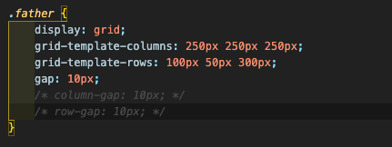

#### 2.2 Grid Template Areas

- **grid-template-areas**: grid의 각 공간에 들어갈 내용을 정의함
  → **father에 grid-template-area** 선언, 정의내용 작성  
  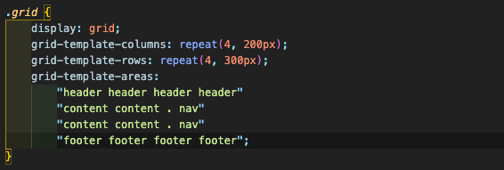  
  → **child에 grid-area** 선언, 각각의 child와 grid-area를 매칭 **(class이름과는 상관없음!)**  
  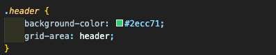  
  cf> 특정 grid를 비울 때 : grid-template-areas에 " ."으로 표시

  **important!> grid가 적용되지 않는 경우**  
  **1. grid-area의 영역이 전부 이어져 있지 않을 때** (ex> header가 둘로 쪼개져 있을 경우, grid 반영 안됨)
  **2. grid-area의 영역이 직사각형이 아닐 때** (ex> header가 ㄴ자, ㄱ자 등일 경우, grid 반영 안됨)

#### 2.3 Rows and Columns & Shortcuts

- grid-template-area의 배경에 있는 기초 이론 -> **row line number, column line number**를 활용, ~~area를 정할 수 있음~~ (5rows = 6 row lines)
- **grid-row/column-start** : the area starts at certain row/column line number
- **grid-row/column-end** : the area ends at certain row/column line number
  → 각각의 element에 대해서 grid-area를 지정해서 grid-template-areas와 같은 효과를 줄 수 있다.
  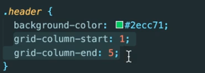

#### 2.4 Shortcuts

- **grid-row/column : start / end** : grid-row/column-start, grid-row/column-end를 합친 shortcut
- **grid-row/column : start / -1** : grid-row/column : start~end (-1, -2 : 끝, 끝에서 2번째..)
- **grid-row.column : start / span no.of.spaces** : grid-row/column가 start로부터 no. of spaces를 차지

#### 2.5 Line naming

- grid-template-columns에서 각각의 line의 이름을 지정할 수 있음 (ex> [first-line] 200px )  
  → line의 이름으로 위의 shortcut 사용이 가능 (ex> grid-column : first-line / fourth-line)

#### 2.6 Grid Template

- **fraction**: meaning available space (**grid container에서만 사용 가능** - display:grid; 가 되어 있는 element)  
  (ex> grid-template-columns : repeat(4, 1fr); → 사용 가능한 width안에서 동일한 width로 grid 4개에 분할)  
  → fluid & reponsive하게 만들 수 있다.
  → **column간의 width 조절은 fr의 배수로 가능** (ex> template-columns: 4fr 1fr 2fr 1fr)
  → **grid를 row에도 적용하기 위해서는 grid의 높이를 설정해주어야 함.**  
  (ex> height: 50vh / grid-template-rows: repeat(4, 1fr))
- **grid-template** : super-shortcut!
  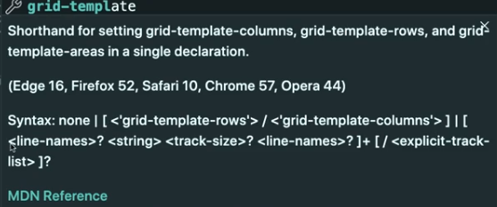  
  ex> 사용 예시  
  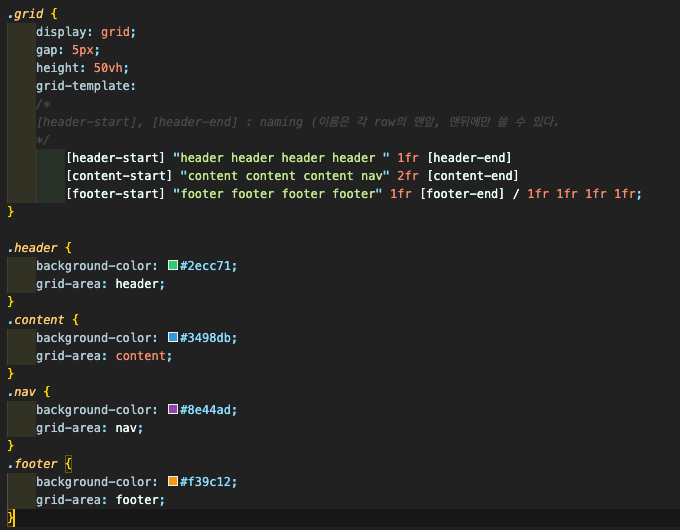

  cf> you cannot use repeat on the grid-template

#### 2.7 Place Items

- "Items"→ **each one of cells** : grid안에 각 cell들을 어떻게 배치할 것인가 설정이 가능
- **justify-items** : define the placement of cells in the grid **"horizontally"**  
  (options: stretch(default) / center / start / end...)
- **align-items** : define the placement of cells in the grid **"vertically"**
  (options: stretch(default) / center / start / end...)
- 각각의 cell의 width/height에 대한 설정이 있을 경우, stretch는 적용되지 않는다 (높이/너비가 이미 정해져 있으므로)
- **place-items** : align-items + justify-items combined  
  ex> place-items: strecth center -> stretch vertically & center horizontally

#### 2.8 Place Content

- "Content"→ **the whole grid** (not grid element) : grid-container안에 전체 grid를 어떻게 배치할 것인가 설정이 가능
- **justify-content** : define the placement of grid within the grid-container **"horizontally (column-base"**  
  (options: start(default) / center / space-around / space-between...)
- **align-content** : define the placement of grid within the grid-container **"vertically (row-base)"**
  (options: start(default) / center / space-between / end...)
- grid-template-columns, grid-template-rows에 width/height에 대한 설정이 있을 경우, stretch는 적용되지 않는다 (높이/너비가 이미 정해져 있으므로)
- **place-content** : align-content + justify-content combined  
  ex> place-content: end center -> move to the end vertically & center horizontally

#### 2.9 Auto Columns and Rows

- **align-self**: grid-container의 child 1개에 선언하는 property. Define placement **vertically**  
  ex> align-self: center
- **justify-self**: grid-cntainer의 child 1개에 선언하는 property. Define placement **horizontally**  
  ex> align-self: center
- **place-self: vertically horizontally** : align-self + justify-self
- **grid-auto-rows** : 지정한 수에 row수에 비해 실제 데이터 수가 더 많을 경우, **지정한 수 이상의 데이터에 대해 정한 height를 반영**  
  (e.g. grid-auto-rows: 150px;)
  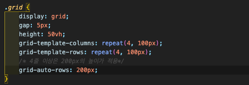
- **grid-auto-flow** : grid의 생성 방향을 정한다 (row방향, column방향 / **default: row**)
- **grid-auto-columns** : 지정한 수에 column수에 비해 실제 데이터 수가 더 많을 경우, **지정한 수 이상의 데이터에 대해 정한 width를 반영**  
  (e.g. grid-auto-columns: 250px;)  
  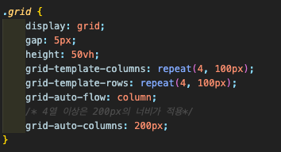

#### 2.10 minmax

- **minmax(min, max)**: specify how little element can be / how big element can be
  → window의 크기에 비례해서 element의 크기가 변하는 1fr로 row/column의 size를 define했을 때 주로 사용
  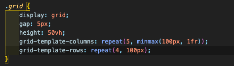

#### 2.11 auto-fit, auto-fill

- make responsive design in a super easy way! (**only able to be used on repeat function**)
  → Use instead of specifying numbers of elements
- **auto-fill**: fills the row with **as many columns as possible** even if those columns are empty  
  (사용예: repeat(auto-fill, minmax(100px, 1fr));) → 개별 element의 크기가 **고정** (exact size)
- **auto-fit**: fits in the row with current elements by stretching / shrinking them  
  (사용예: repeat(auto-fit, minmax(100px, 1fr));) → 개별 element의 크기가 **가변** (fluid size)  
  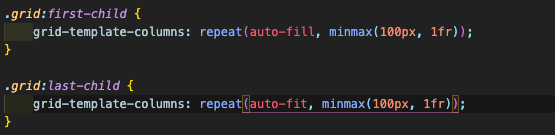  
  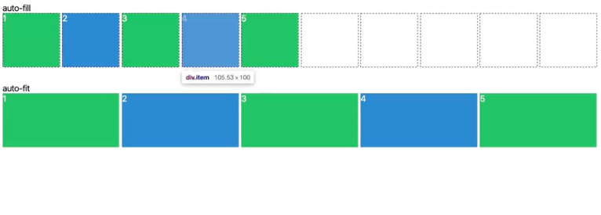

#### 2.12 mix-content, max-content

- to make the size of element **depending on the size of content** → **grid-container의 size정보 (1fr, pixel..)가 표시되는 곳에서 사용**
- **min-content** : make the element **as small as the content can be** (element안의 내용이 **들어갈 수 있는 최소한의 크기**의 사이즈를 적용)
- **max-content** : make the element **as big as the content needs** (element안의 내용이 **필요한 최대한의 크기**의 사이즈를 적용)
  → 안에 들어 있는 내용에 따라서 element의 사이즈가 변할 수 있다. **~~(We now can only take care of the size of content, not the size of element itself!)~~**  
  (left: max-cointent / right: min-content)  
  
  - auto-fit / auto-fill / minmax등과 함께 사용 가능  
    → 사용예시 : grid-template-columns: repeat(5, minmax(**min-content**, 1fr));  
    → 사용예시 : grid-template-columns: repeat(auto-fit, minmax(20px, **max-content**));
