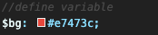
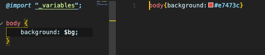
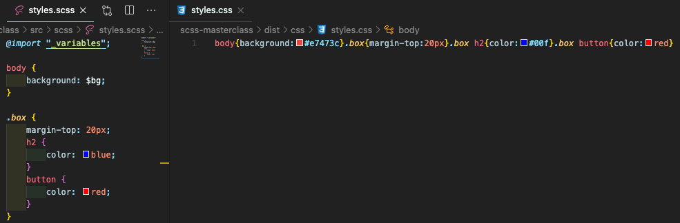
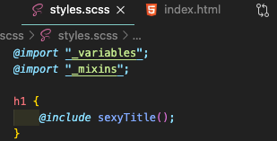
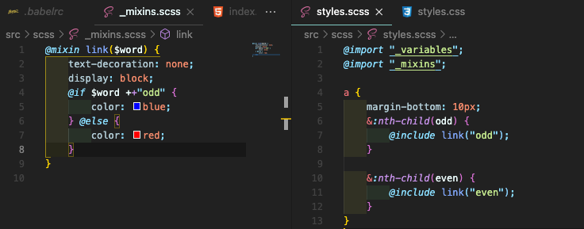
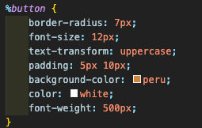
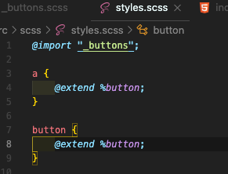
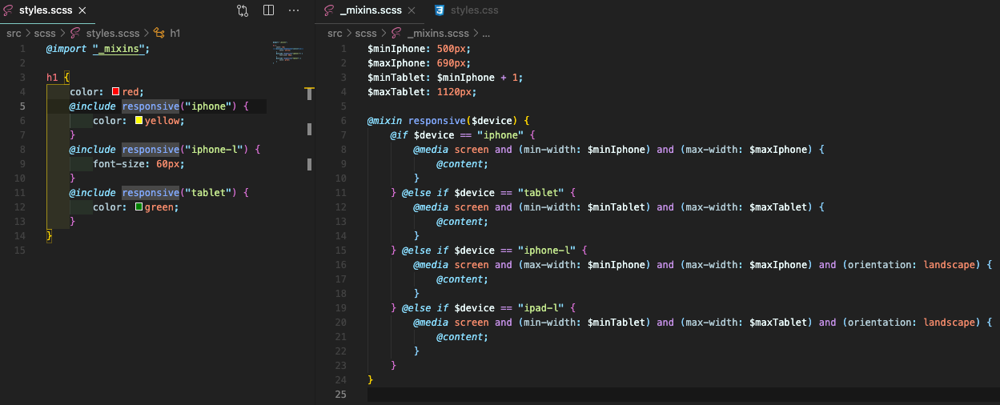

### 3. SCSS

#### 3.0 What is SCSS? (<a href="https://sass-lang.com/guide">Link</a>)

- **SCSS : CSS Preprocessor → compile SCSS and make normal CSS**
- SCSS makes CSS like a programming language! (variables, functions...)  
  (**npm / gulp를 사용해서 scss의 내용이 자동으로 css로 compile되게끔 구성되어 있음**)
  (gulp? (<a href="https://ko.wikipedia.org/wiki/Gulp.js">Link</a>) - npm기반 빌드 시스템. 테스트시 에러 등 확인 가능.)
- 환경설정
  1. npm install → npm run dev 실행: gulpfile의 내용을 활용하여 빌드 시스템을 실행
  2. gulpfile속의 scss, css의 경로를 확인
  3. HTML에 css의 경로가 셋팅되어 있는지 확인 (browser doesnot understand scss!)

#### 3.1 Variables and Nesting

- "Coolest" feature of SCSS
- **Variables** : use **to save the most important styles** of the website.

  1. **create the "\_name.scss" file** under ~~src/scss route~~  
     (\_filename.scss : "do not want to compile to css")
  2. **define variables** in the form of **$variable_name : variable_value;**  
     
  3. **import the file in "styles.scss" file** and use it  
     → font-size, shadow...등등을 저장해서 계속 불러 사용할 수 있음  
     

- **Nesting** : allows your code to **target the element more precisely**  
  (stltes.scss 파일 안에 **코드를 적는 방식**)  
  → css에서는 따로 적어야 하는 코드를 네스팅 해서 적을 수 있음, 더 정확한 코딩이 가능.
    
  **→ 진짜 프로그래밍 언어 같다! 훌륭!**

#### 3.2 Mixins

- **Mixins**: allows you to **apply different codes** according to different conditions, **like a conditional**  
  →**You can pass inputs to the mixins and the inputs will change the output of CSS.**  
  → element에 값을 전달해서 다이나믹하게 바꾸는 것이 가능! (just like programming language!)

  1. **create the "\_name.scss" file** under ~~src/scss route~~  
     (\_filename.scss : "do not want to compile to css")
  2. **import the file in "styles.scss" file** and use it like a function  
     

- Mixins are more useful **when you want to add certain features to the multiple elements** (just like functions)  
  
- It is possible to **write conditionals in the mixins**  
  

#### 3.3 Extends

- **Extends** : allows you to not to repeat writing the ~~same code~~
  1. **create the "\_name.scss" file** under ~~src/scss route~~  
     (\_filename.scss : "do not want to compile to css")
  2. **define extending contents** in the form of **%extend_name {};**  
       
     → 　한 화면에서 **여러 종류의 element들의 style을 서로 분리해서 관리할 때** 특히 유용하다!
  3. **import the file in "styles.scss" file** and use it in the element  
      
     → 여러 element에게 공통으로 적용되는 것은 extend로 css에 넣고, 그외 다른 스타일만 개별적으로 적어주면 된다.

#### 3.4 Awesome Mixins and Conclusions

- **content** : styles.css에 **@include를 활용**해서 정의한 내용을 mixins에 **@content로 끌어와 사용**할 수 있음.  
  
- There are many mixins library (<a href="https://github.com/Famolus/awesome-sass">Link</a>) : **Bourbon** / **Saas Media query** / **animate.css** 등등!

이후는 cloning 진행할 것.
